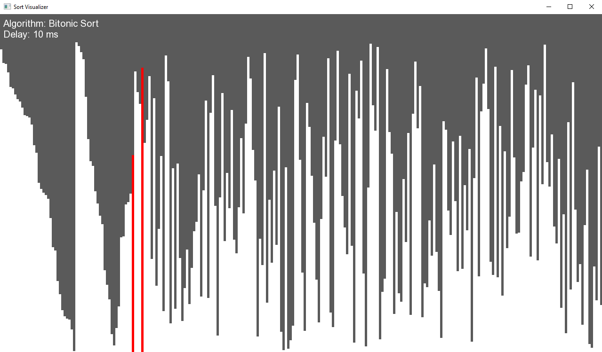

# SortVisualizer

A simple application for visualizing sorting algorithms written with C++ & SFML.

## Algorithms

The visualizer supports the following algorithms:

 - Bubble Sort
 - Selection Sort
 - Radix Sort
 - Quick Sort
 - Merge Sort
 - Insertion Sort
 - Ripple Sort
 - Gnome Sort
 - Stooge Sort
 - Pancake Sort
 - Cycle Sort
 - Heap Sort
 - Shell Sort
 - Bitonic Sort

## Requirements

You will need `Visual C++ 17` and a version of `SFML 2.4+` statically compiled for your platform (you may have to use a different compiler and adapt the source to your needs).  You will have to change the dependency directories in Visual Studio solution to wherever your local copy of SFML is stored. **THIS REPOSITORY DOES NOT CONTAIN AN SFML DISTRIBUTION, NOR ANY OF IT'S REQUIRED STATIC FILES**.

## Contributing

If you would like to add a feature or sorting algorithms just make a pull request and I will review it.  When designing your algorithms keep in mind that you want to showcase the algorithm.  Make sure to call `arr.draw()` wherever you see fit to update the display.

There is very little to no documentation of the source as it is just a very small side project of mine.  Feel free to use it as a base for whatever you want. 

## Command Line Interface

	.\SortVisualizer sort-name [-d ms] [-c count] [-w width] [-h height] [-f]

| Flag | Meaning | Arguments | Default Value | Required |
| `sort-name` | The name of the sorting algorithm minus its " Sort" suffix | name | *none* | **Yes** |
| `-d` | The operation delay in milliseconds | ms | 1 | **No** |
| `-c` | The number of randomly shuffled elements to sort | count | 256 | **No** |
| `-w` | The width of the screen in pixels (non resizable) | width | 1280 | **No** |
| `-h` | The height of the screen in pixels (non resizable) | height | 720 | **No** |
| `-f` | If this flag is present, the sort will run in fullscreen | *none*  | *none* | **No** |

These parameters are all optional except for `sort-name` and are in no particular order. (the flags can be given in any order)
